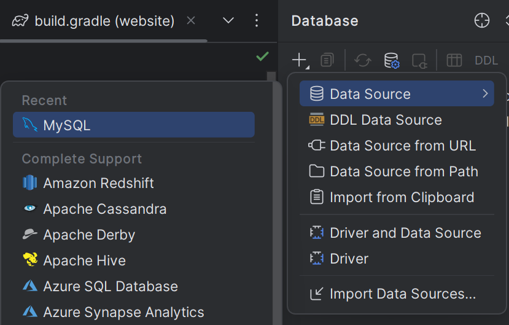
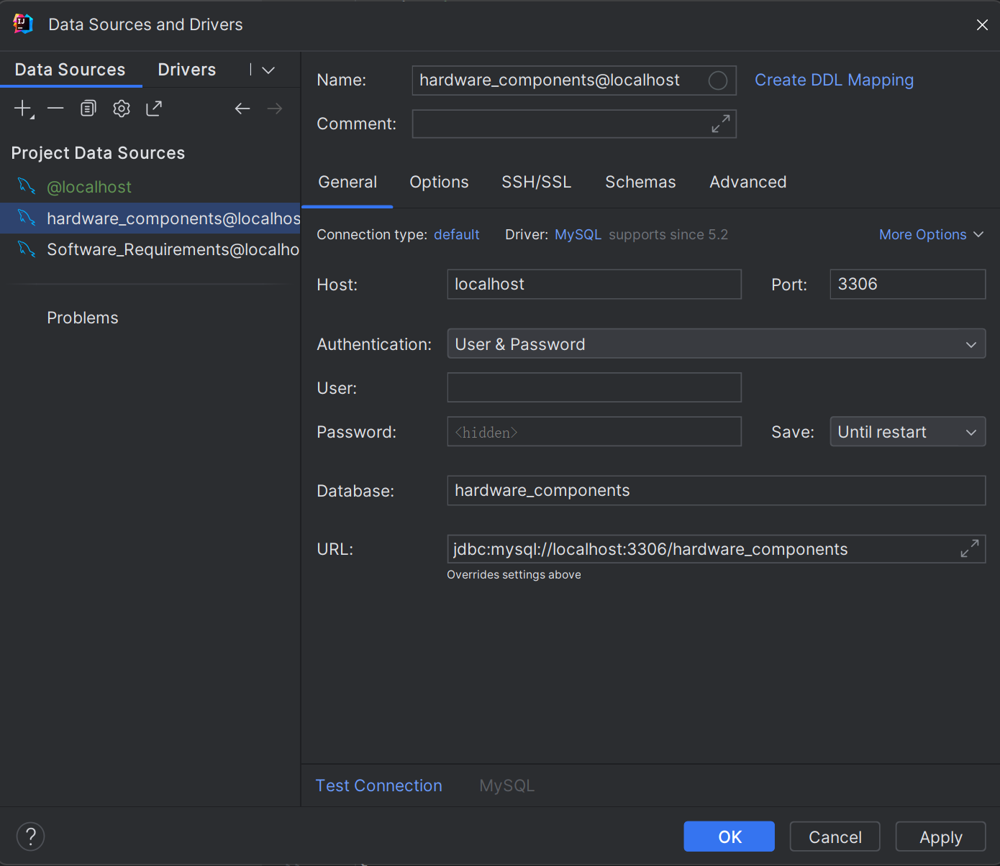

# OptiBuild Project

## Project Description

Optibuild serves to provide a personal list of computer component recommendations. We aim to have a more extensive compatibility checker, narrowing down a list of components for users by asking what they use their computer for.

## Back End Description

The backend is built using Spring Boot and comprises the following key components:

- **QuestionController:** This component provides APIs for communication with the frontend to handle answers to website questionnaires and returns a set of components.
- **Model:** Entity classes defining the data structure.
- **Repository:** Interfaces responsible for performing CRUD operations on the database based on the data structure defined in the model.
- **Service:** Contains the business logic for handling component selection, answer parsing, and compatibility checks.
- **OptiBuildWebsiteApplication:** Entry point for starting the application.

## Front End Description

This project is a web application developed using React.js. It includes several key components that are currently in use:

* Survey.js: The main component that orchestrates the rendering of other components. This java script file contains both cover page of our product and the survey for the user to answer. 
* ProgressBar.js: A separate component that interact with the Survey.js to show the user the progress they have made for the survey. 
* Submission.js: A component that shows the final build of the user's personalized computer. 

Each of these components is styled with its corresponding CSS file.

## Database Description

- **Hardware_Components:** This hardware components database includes the tables of all types of hardware components and their various characteristics, used for compatibility checking and comparisons and evalutions between the component type. 
- **Software_Requirements:** This software requirements databse includes the tables for different software types and their various characteristics. These will outline the core hardware components to run well for base and recommended use cases. Currently, only contains game requirements.

### Hardware Database Entity Relationship


### Game Requirements


## How to use MySQL on command line
login to mysql on command line
* mysql -u root -p

If you want to import existing .sql file, you have to (First create database with database_name if not done so already):
* cd path to your file
* mysql -u username -p database_name < file_name.sql

## Installation Instructions

### Back End

### 1. Install ngrok

Make sure ngrok is installed on your system. You can find installation instructions here:

https://dashboard.ngrok.com/get-started/setup/windows

### 2. Install Java JDK

If you haven't already installed Java JDK, follow the installation instructions for your operating system. You can find the appropriate Java JDK for your system [here](https://www.oracle.com/java/technologies/javase-jdk11-downloads.html).

### Front End

1. Clone the repository to your local machine.
2. Navigate to the project directory.
3. Run npm install to install all the necessary dependencies.

Start the frontend by running `npm start` in the project directory. Open your web browser and go to http://localhost:3000 to view the application.

Start the whole client application (React SocketCounter.js and Client.js) by running `npm concurrent start`

**Make sure to adjust the IP address and port number in Client.js to the specified server location.**

## Usage

Please follow the instructions below to run the server and frontend sequentially:

### Running the Back End

### 1. Set up Local MySQL Schema

Create the necessary schema in your local MySQL database. You can create it manually.





Please configure according to your local port and address, then click 'Test Connection' to ensure the connection is successful, and then click 'OK'.

### 2. Start the Application

First, make sure you are in the project directory and the project has been compiled.

Run the following command to start the server:

```
gradle build
java -jar website.jar
```

### 3. Start ngrok Tunnel

Start an ngrok tunnel from the command line to map your local server to a public URL:

```
ngrok http --domain=sincere-accurately-foal.ngrok-free.app 8080
```

### 4. Confirm Server Running

Access the generated ngrok URL or any other relevant URL to confirm that the server is running successfully. You can also check the server logs for confirmation.

Your server should now be running successfully and accessible via the public URL!

### Running the Front End

Start the frontend by running `npm start` in the project directory. Open your web browser and go to http://localhost:3000 to view the application.

Start the whole client application (React SocketCounter.js and Client.js) by running `npm concurrent start`

**Make sure to adjust the IP address and port number in Client.js to the specified server location.**

* Cover Component: Interact with the cover page to navigate through to the survey component. 
* Survey Component: Fill in the required fields to simulate the answering process.
* Submission Component: This component will connect to out database server and display real-time data regarding the personal computer. Ensure the server is running and accessible.

## Contributing

* Contributions to this project are welcome. Please follow these steps to contribute:

1. Fork the repository.
2. Create a new branch for your feature.
3. Commit your changes.
4. Push to the branch.
5. Create a new Pull Request.

## Authors and Acknowledgment

Xinye(Sherry) Miao, Albert You, Heng Meng (Donny) Lee, Tze Fung (Daniel) Wong 

## Contact Information

 Xinye Miao: xmiao39@gatech.edu

## FAQs

Answers to frequently asked questions.

## Changelog

A log or history of changes made to the project.
